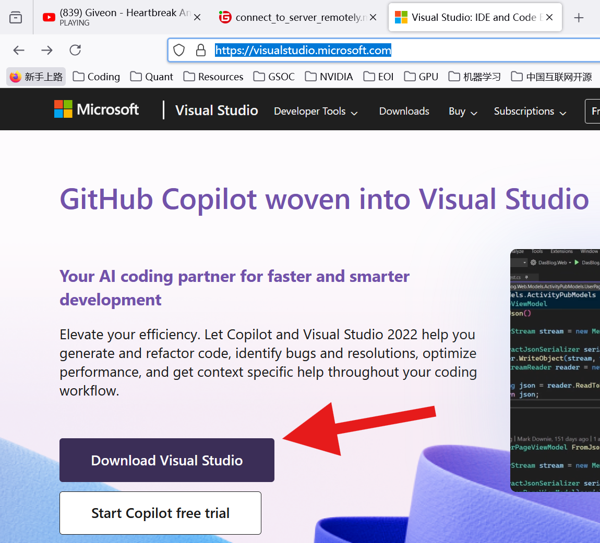

# 如何远程连上伺服器

## 设置Visual Studio

### 1. 下载Visual Studio并且安装

链接: https://visualstudio.microsoft.com/



### 2. 打开Visual Studio，并且打开插件市场Extensions，下载Remote-ssh

!

### 3. 下载完之后侧边栏会出现Remote Explorer的图示，点击图示将会出现REMOTES->SSH的栏目


### 4. 点击**+**图标，会跳出指令行


### 5. 键入以下命令行，并且回车
```bash
ssh root@58.34.49.226:端口
```


### 6. 回车之后，选择第一个选项(最后一定是接着.ssh\config)


### 7. 右下角弹出提示，点击Connect


### 8. VS Code会弹出全新的视窗，并且有弹出选项，选择Linux，然后继续点击Continue，之后输入伺服器密码


### 9. 打开侧边栏查看Remote Explorer，如果有这个绿标的话表示连接成功

 
## 在伺服器环境中安装miniconda

### 1. 打开Terminal


### 2. 下方弹出伺服器终端的命令行界面，从这边就可以直接操作Linux系统


### 3. 复制贴上以下命令下载miniconda， 并且执行安装
```bash
wget https://mirrors.tuna.tsinghua.edu.cn/anaconda/miniconda/Miniconda3-py312_24.5.0-0-Linux-x86_64.sh | sh
```

### 4. 安装中提示回答的顺序为**yes** -> **回车** --> **yes**


### 5. 安装完毕之后关闭目前的终端子视窗


### 6. 按照步骤1方式，再开一个新的Terminal，这时候会发现命令行的多了前缀(base)，代表miniconda已经成功安装并且激活base的环境


> 如果你没有看到(base)前缀，代表你没有成功安装miniconda，最好的解决方式是重新安装，先在命令符执行`rm -rf miniconda3/`删除miniconda3的文件夹，再重新执行步骤3-6


### 7. miniconda可以创建用来容纳所有python模块的环境，就像是一个百宝袋，这边我们来创建一个环境，复制贴上以下命令行并且回车，miniconda将会下载python以及模块到环境中
```bash
conda create --name py310 python=3.10
```

### 8. 耐心等待，安装中会有提示，**y**接着回车就可以了


### 9. 最后键入`conda activate py310`激活刚刚创建的`py310`的环境即可


### 10. 激活之后就可以看到命令行的前缀变更成我们创建的`py310`环境名了

